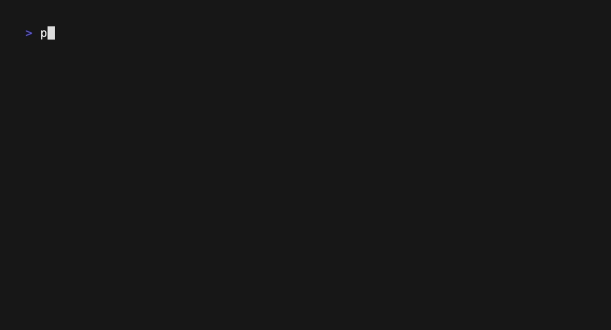
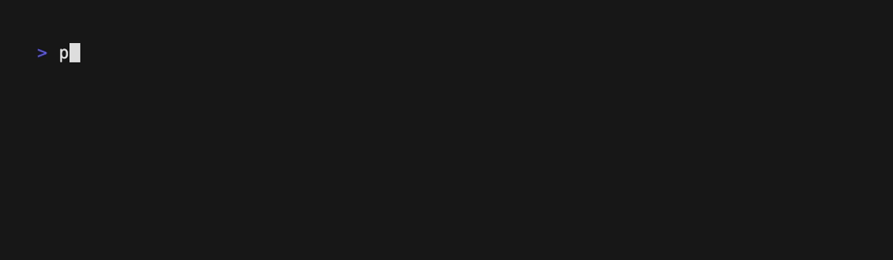

# Multi-Tenant Go Server Example

This project demonstrates a Go multi-tenant server setup using subdomain routing and PostgreSQL Row-Level Security (RLS) to ensure data isolation among tenants.

## Getting Started

To get the server running locally:

1. **Clone the repository**:

    ```sh
    git clone https://github.com/alvinchoong/go-multi-tenant-server.git
    ```

2. **Install dependencies**:

    ```sh
    go mod download
    ```

3. **Start the server**:

    ```sh
    make up run
    ```

4. **Access the API** at one of the following URLs to simulate multi-tenancy:
    - <http://user-1.lvh.me:8080>
    - <http://user-2.lvh.me:8080>
    - <http://user-3.lvh.me:8080>

> **Note:** `lvh.me` resolves to `127.0.0.1`, allowing local development with subdomain simulation without modifying the hosts file.

## Postman Collection

This collection provides a set of pre-configured API requests for testing and exploring the multi-tenant server's functionality.

1. **Import the Postman Collection**:
   - In Postman, click "Import" and select "Link."
   - Paste this URL:
   `https://github.com/alvinchoong/go-multi-tenant-server/blob/main/docs/multi-tenant.postman_collection.json`

2. **Update Collection Variables**:
   - Go to the imported collection's "Variables" tab in Postman.

3. **Explore the API**:
   - Test and explore the API endpoints provided in the collection.

## How It Works

### Database

1. Row-Level Security (RLS)

    PostgreSQL's RLS ensures that each tenant can only access their own data. RLS policies restrict row access by comparing each row's tenant identifier with the current session's tenant:

    ```sql
    -- RLS Policy
    CREATE POLICY todo_isolation_policy ON todos
      USING (user_slug = current_setting('app.current_user'));

    -- Enable RLS
    ALTER TABLE todos ENABLE ROW LEVEL SECURITY;
    ```

2. Query Execution:

    With RLS policies in place, you can run queries that attempt to access all records, but the results will automatically be filtered based on the current session's tenant:

    

    If the tenant is not set, access will be restricted:

    

### App

The application leverages the database's RLS configurations to ensure that each tenant's data access is restricted appropriately. Here's how it translates these settings into its operational logic:

1. Identifying the Tenant

    The app uses subdomains to identify tenants. The middleware extracts the subdomain (tenant identifier) from the request and stores it in the context for subsequent access:

    ```go
    // extractTenantMiddleware extracts the subdomain (tenant identifier) and adds it to the request context
    func extractTenantMiddleware(host string) func(next http.Handler) http.Handler {
        return func(next http.Handler) http.Handler {
            fn := http.HandlerFunc(func(w http.ResponseWriter, r *http.Request) {
                ctx := r.Context()

                // Extract the subdomain (tenant identifier) by removing the main domain
                subdomain := strings.TrimSuffix(r.Host, "."+host)
                if subdomain != "" && subdomain != host {
                    // Store the subdomain in the request context for future access
                    ctx = context.WithValue(ctx, TenantCtxKey, subdomain)
                }

                // Serve the request with the modified context
                next.ServeHTTP(w, r.WithContext(ctx))
            })

            return http.HandlerFunc(fn)
        }
    }
    ```

2. Configuring Database Session

    Utilizes the [pgxpool BeforeAcquire](https://github.com/jackc/pgx/blob/v5.5.5/pgxpool/pool.go#L114-L117) hook to configure each database session with the necessary tenant context. This setup allows the database to restrict data access in accordance with RLS policies:

    ```go
    // DB hook before acquiring a connection
    beforeAcquire := func(ctx context.Context, conn *pgx.Conn) bool {
        // Extract the tenant identifier from the request context
        if s := router.TenantFromCtx(ctx); s != "" {
            // Set the tenant for the current database session
            rows, err := conn.Query(ctx, "SELECT set_config('app.current_user', $1, false)", s)
            if err != nil {
                // Log the error and discard the connection
                slog.Error("beforeAcquire conn.Query", slog.Any("err", err))
                return false
            }
            rows.Close()
        }
        return true
    }
    ```

## Row-Level Security Notes

- **Superusers**: Can bypass all RLS policies.
- **BYPASSRLS Roles**: Designated roles that bypass RLS.
- **Table Owners**: Default bypass can be overridden with RLS enforcement.

For further details, refer to the official [PostgreSQL documentation](https://www.postgresql.org/docs/current/ddl-rowsecurity.html#DDL-ROWSECURITY).

## Resources

- [PostgreSQL Row-Level Security Documentation](https://www.postgresql.org/docs/current/ddl-rowsecurity.html)
- [Multi-tenant data isolation with PostgreSQL Row-Level Security](https://aws.amazon.com/blogs/database/multi-tenant-data-isolation-with-postgresql-row-level-security/)
